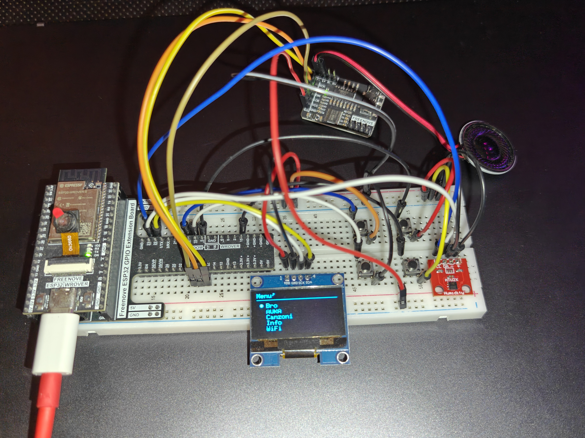
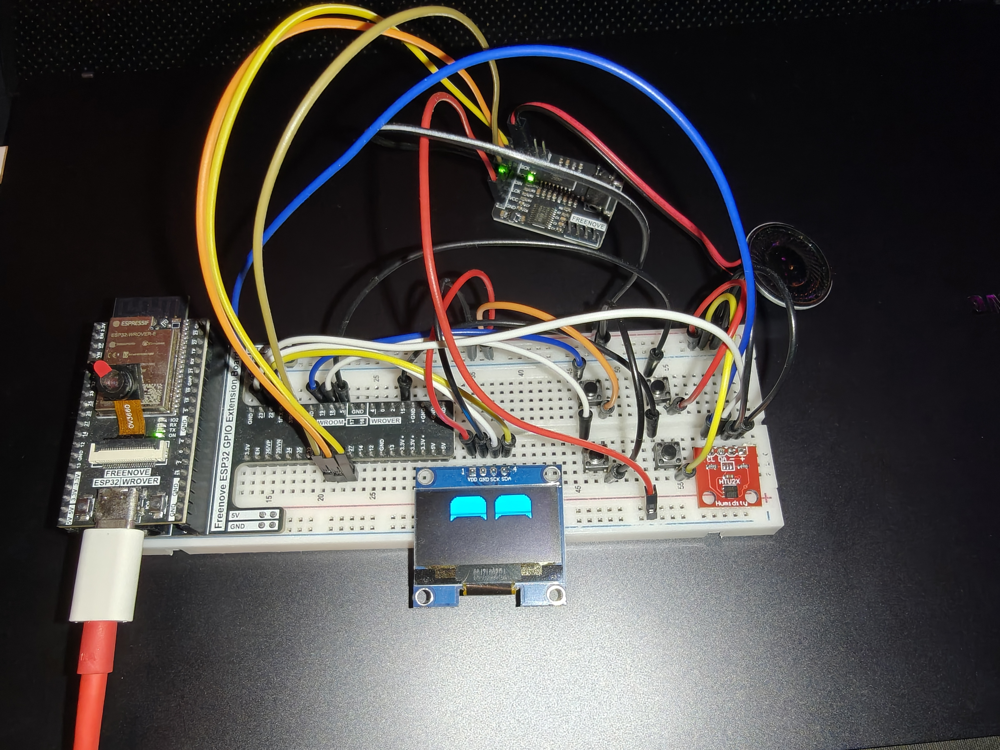
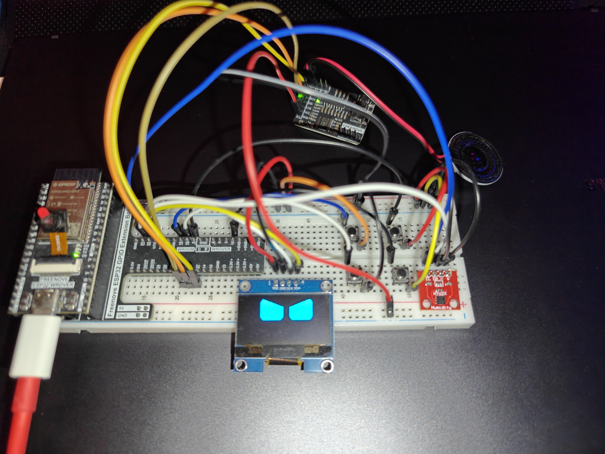
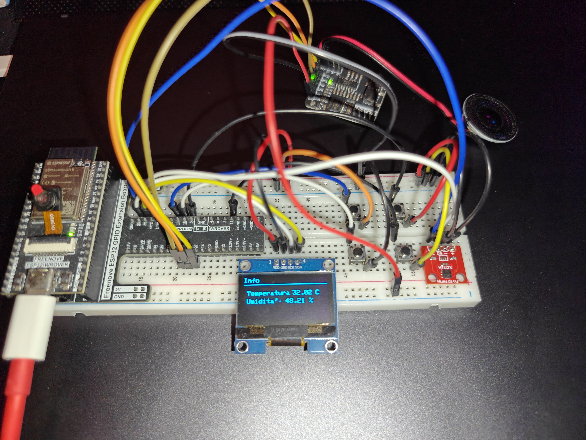
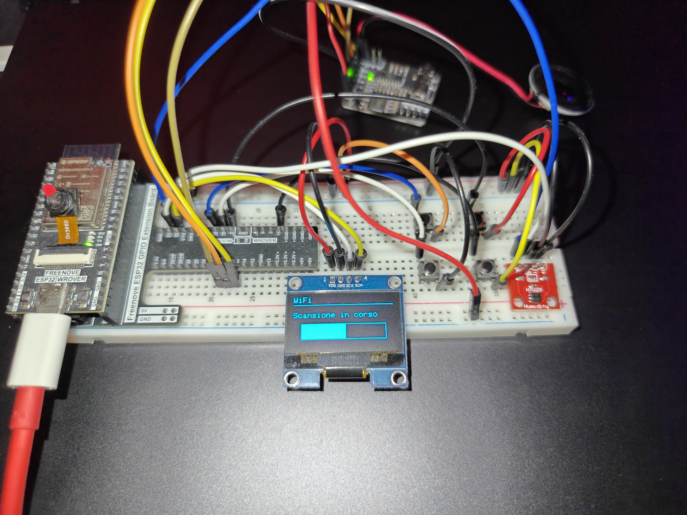
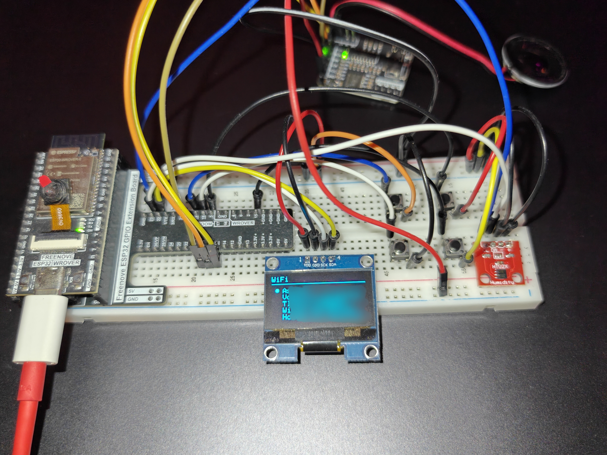
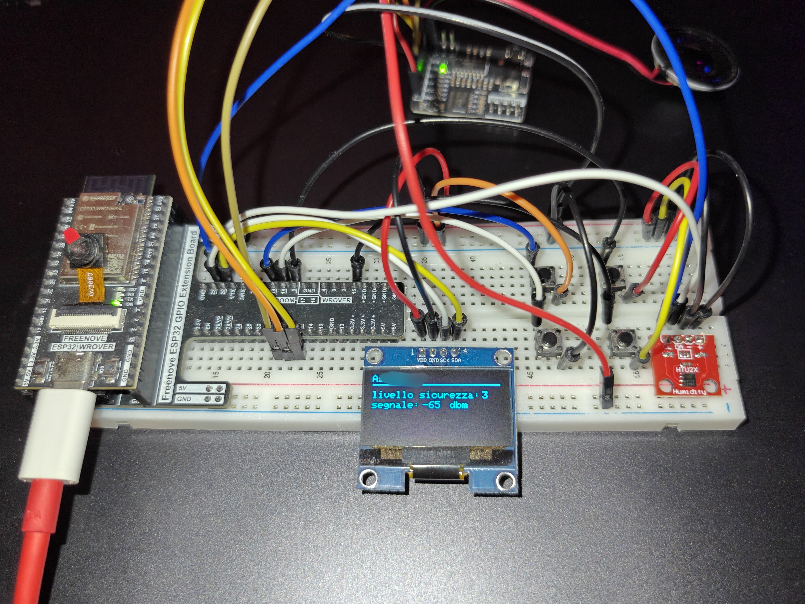

# ESP32 OLED Menu

Un progetto personale basato su ESP32 che usa un display OLED come interfaccia per un piccolo dispositivo multifunzione. Il menu, controllato con quattro pulsanti, permette di ascoltare musica da microSD, visualizzare temperatura e umidità, cercare reti Wi-Fi e mostrare animazioni sullo schermo.

Il progetto è ancora in lavorazione: alcune voci del menu sono già presenti come base per funzioni future.

## Galleria

### Il prototipo e il menu



### Bro: occhi animati

| Espressione felice | Espressione arrabbiata |
| --- | --- |
|  |  |

### Info: temperatura e umidità

La schermata Info mostra i valori rilevati dal sensore HTU21D.



### WiFi

La funzione WiFi guida l'utente dalla scansione delle reti fino alla visualizzazione dei dettagli della rete selezionata.

| Scansione in corso | Elenco delle reti trovate | Dettagli della rete |
| --- | --- | --- |
|  |  |  |

## Funzioni disponibili

- **Bro**: mostra occhi robotici animati sul display.
- **AURA**: riproduce `aura.mp3` dalla microSD e consente di regolare il volume.
- **Canzoni**: cerca nella microSD file `.mp3` e `.wav`, quindi permette di selezionarli e riprodurli.
- **Info**: visualizza temperatura e umidità rilevate dal sensore HTU21D.
- **WiFi**: esegue una scansione delle reti disponibili e mostra nome, intensità del segnale e tipo di sicurezza della rete selezionata.

Le voci SONAR, PIR, Termini, Condizioni ed Exit sono previste per sviluppi successivi.

## Componenti

- ESP32
- Display OLED 128×64 con driver SH1106 (indirizzo I2C `0x3C`)
- Sensore di temperatura e umidità HTU21D / HTU21DF
- Modulo microSD usato in modalità SD_MMC
- Modulo audio I2S e altoparlante
- Quattro pulsanti

## Comandi

I pulsanti servono per navigare nel menu:

| Azione | GPIO ESP32 |
| --- | ---: |
| Su | 19 |
| Giù | 18 |
| Conferma | 5 |
| Indietro | 15 |

I pulsanti usano la configurazione interna `INPUT_PULLUP`: ciascuno va quindi collegato tra il GPIO indicato e GND.

## Collegamenti principali

| Funzione | GPIO ESP32 |
| --- | ---: |
| I2C SDA | 22 |
| I2C SCL | 23 |
| Audio I2S BCLK | 27 |
| Audio I2S LRC | 25 |
| Audio I2S DOUT | 26 |

## Musica sulla microSD

Inserire i brani `.mp3` o `.wav` nella cartella principale della microSD. Il menu può mostrare fino a 20 file audio.

Per usare la voce **AURA**, aggiungere alla microSD un file con questo nome:

```text
aura.mp3
```

## Librerie necessarie

Installare dall'Arduino Library Manager (o dai rispettivi repository) le seguenti librerie:

- Adafruit GFX Library
- Adafruit SH110X
- Adafruit HTU21DF
- ESP32-audioI2S (`Audio.h`)
- FluxGarage RoboEyes

Le librerie `Wire`, `WiFi` e `SD_MMC` fanno parte del core ESP32 per Arduino.

## Avvio

1. Aprire `OLED1.3_MENU_2.3.ino` nell'Arduino IDE.
2. Selezionare una scheda ESP32 compatibile.
3. Installare le librerie indicate sopra.
4. Collegare i componenti e, se si usa la sezione musicale, inserire la microSD.
5. Caricare lo sketch.

## Stato del progetto

Questo repository raccoglie una versione funzionante ma in evoluzione del progetto. L'obiettivo è continuare a migliorare il menu, aggiungere sensori e completare le voci già previste.

Il prossimo obiettivo è trasformare il prototipo su breadboard in un dispositivo portatile e più robusto. I componenti verranno trasferiti su una scheda millefori, con collegamenti saldati in modo definitivo.

Sarà inoltre aggiunto un sistema di alimentazione a batteria, con relativa gestione di ricarica e distribuzione dell'alimentazione ai vari moduli.

## Licenza

Questo progetto è distribuito sotto licenza MIT. Puoi utilizzare, modificare e distribuire il codice, anche per progetti commerciali, mantenendo l'avviso di copyright e il testo della licenza. Il software è fornito "così com'è", senza garanzie.
